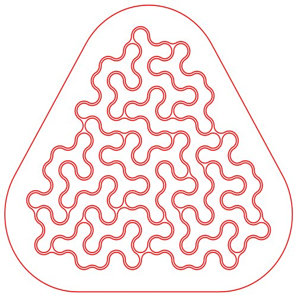

<p align="center"><p>

# FractalJigsawPuzzle
C++ program for generating SVG files representing Fractal Jigsaw Puzzles optimized for laser cutting

For blogs about the developement see:
http://www.iwriteiam.nl/Dpuzzle.html#fracjig

Ready made puzzles can be ordered from:
https://www.annabelester.nl/

# Example usage

Start for example with:
```
./pianofrac gen_ec -con -range=2-3 -with_name | ./ExactCover | ./pianofrac normalize -minimal >sols.txt
```
The file `sols.txt` will now contains all solutions. Some solutions will use the same pieces and thus
can be viewed as solutions for the same puzzle. To get the file with all puzzles, use:
```
./pianofrac used_pieces <sols.txt | sort | uniq -c | sort >puzzles.txt
```
Now you can select one of the puzzles. Take for example: `1,1,1,2,2,2,2,2,3,4,4,4,4,7,7,10`.
To print all the solutions for this puzzle, use the command:
```
./pianofrac filter 1,1,1,2,2,2,2,2,3,4,4,4,4,7,7,10 <sols.txt | ./pianofrac print
```
To generate an SVG file for this puzzle, use, for example:
```
./pianofrac filter 1,1,1,2,2,2,2,2,3,4,4,4,4,7,7,10 <sols.txt | ./pianofrac svg -space=2 >puzzle.svg
```

# Detailed description

There are a number of steps involved to generate a puzzle. The generated puzzles consists pieces which
are build out of one of more fractal shaped units. These unit can be considered as triangles which are
placed in a triangular grid. The first step of the generation is to determine the kinds of pieces that
are to be used.

The second step is to select a puzzle based on the number of pieces and the number of solutions
that a puzzle has. (Note that the number of solutions that a puzzle has, [does not](https://www.iwriteiam.nl/D1907.html#3)
say much about it complexity.)

## Selecting the pieces to be used

The command `gen_ec_hc` (which stands for GENerate Exact Cover with Harded Coded) generated input for
the [Exact Cover](https://en.wikipedia.org/wiki/Exact_cover) solver (the inluded program `ExactCover.cpp`)
with a hard coded set of pieces. An example usage of this command is:
```
./pianofrac gen_ec_hc -with_name | ./ExactCover | ./pianofrac normalize -minimal >sols.txt
```
The `-with_name` option is needed for some of the remaining commands. The above command pipes the
generated piece positions into the Exact Cover solver and the result of that is post processed to
remove double solutions with the `normalize` command.

It is also possible to select pieces on their size using the `gen_ec` command and to specify a
range of sizes with the `-range=` option, which can be follow by numbers separated with a comma
(like `-range=2,4`) and as a range (like `-range=1-3`) or any combination (like `-range=1,2-4`).
If high numbers are used in the -range option, the command can produce a very large output file,
which in turn could cause the ExactCover program to require a long time to find solutions.
The `-con` option is to include little connection dots that are needed for certain solutions.
Not using the option could reduce the number of possible solutions. An example usage of this
command is:
```
./pianofrac gen_ec -con -range=2-4 -with_name | ./ExactCover | ./pianofrac normalize -minimal >sols.txt
```

## Listing all possible puzzles

The resulting `sols.txt` from the previous example commands will contain all solutions by which
the triangle shape of the frame can be filed with the specified puzzle. Many of these solutions
will use exactly the same pieces and thus be solutions for the sample puzzle. To cound the pieces
the `used_pieces` command can be used. To get a list of puzzles, sorted with increasing number of
solutions, use:
```
./pianofrac used_pieces <sols.txt | sort | uniq -c | sort >puzzles.txt
```
Each line of the `puzzles.txt` file represents one puzzle and contains a comma separated list of
the kinds of pieces that are used, where if a number occurs more than once, it means that that
number of pieces of that kind of piece are used. For example, the string `1,1,1,2,2,2,2,2,3,4,4,4,4,7,7,10`
means that three pieces of kind '1', five pieces of kind '2', one piece of kind '3', four pieces
of kind '7', two pieces of kind '7', and one piece of kind '10' are used in the puzzle.

## Filtering

The file `puzzles.txt` is quite large and also contains many puzzles with a lot of pieces or just
a few number of pieces. To filter out puzzles with many or few pieces the `-min` and `-max` options
can be used. The following command will return all puzzles with at most 17 pieces:
```
./pianofrac used_pieces -max=17 <sols.txt | sort | uniq -c | sort >puzzles.txt
```
To get all puzzles with 16 pieces use:
```
./pianofrac used_pieces -min=16 -max=16 <sols.txt | sort | uniq -c | sort >puzzles.txt
```
If some combination of options result in no solutions at all, the command will return the
upper or lower limits of valid values.

Some solutions will have a lot of pieces of the same kind. There are two options for
selecting puzzles that have less 'double' pieces. The option `-max_occ` restricts the
maximum number of times that a piece of the same shape may occur. And the option `-sup_occ`
restricts the total number of pieces that have the same shape. If for example `-max_occ=2`
is used, it could still be the case that for each piece there is another piece with the same
shape. (This is only possible if there is an even number of pieces and that for each shape
there are two pieces in the design.) With the option `-sup_occ=2` there could be at most
two pieces with the same shape. It makes sense to use both options, as long as the value
for `-sup_occ` is larger than `-max_occ`. The following command will return all puzzles
with at most four the same pieces of each kind of piece that is used in the puzzle:
```
./pianofrac used_pieces -max_occ=4 -max=16 <sols.txt | sort | uniq -c | sort >puzzles.txt
```
The following command will return all puzzles with at most nine 'double' pieces for all
the kinds of pieces used in the puzzle:
```
./pianofrac used_pieces -max_occ=4 -max=16 <sols.txt | sort | uniq -c | sort >puzzles.txt
```

## Printing

(To be continued...)
